# jdk8-source

源码基于jdk1.8.0_271版本

## 运行相关问题解决

### 1.模块加载失败

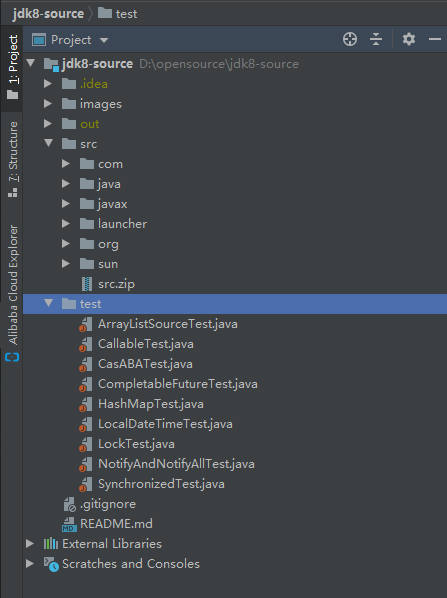

点击**File–>Project Structure–>Modules**
将src目录标记为Sources，将test目录标记为Tests

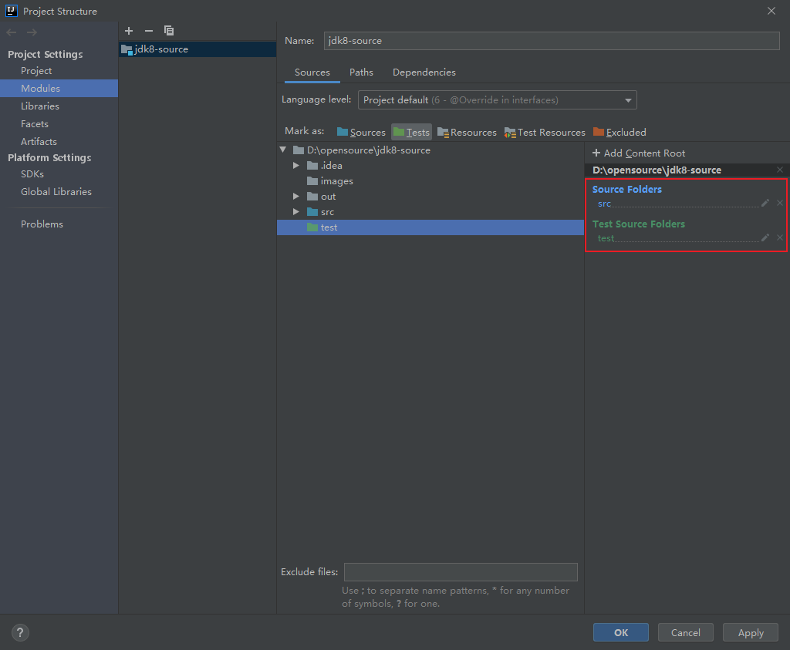

### 2.编译输出路径不存在

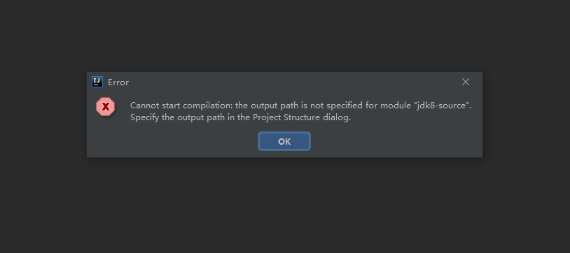

点击**File–>Project Structure–>Project**
配置**Project compiler output**，指向项目根目录下的out目录即可

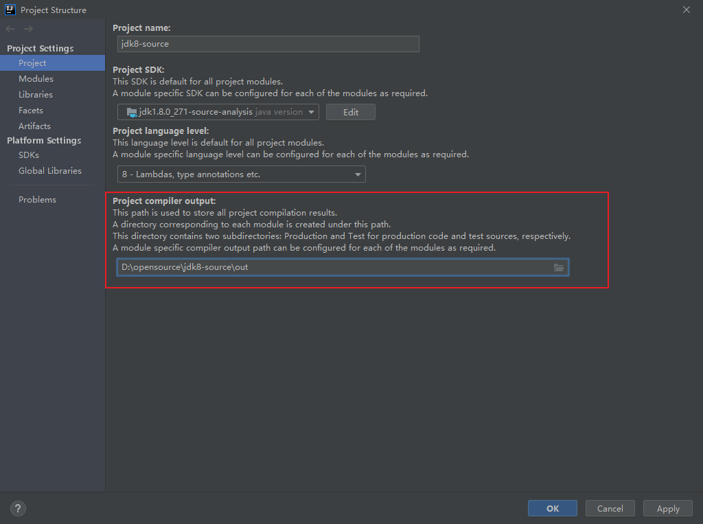

### 3.系统资源不足

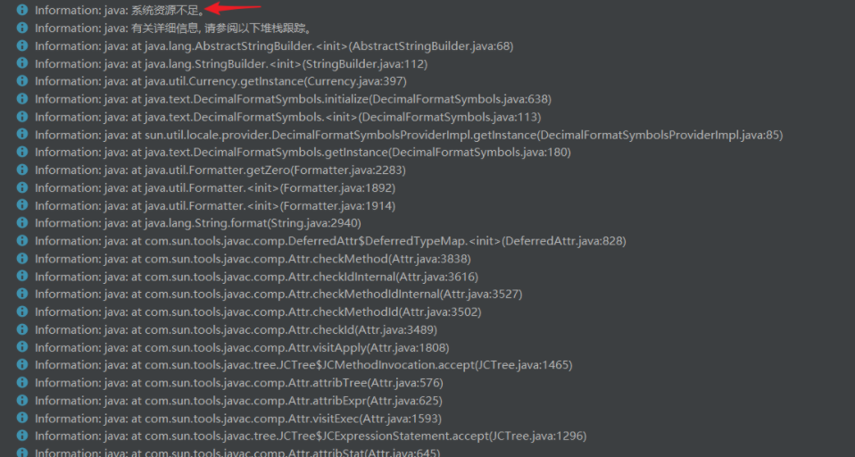

或者编译很久、编译任务不能停止也不继续执行。

导致这些错误出现的原因是内存不够。解决办法当然是加大内存。

点击**File–>Settings–>Build,Execution,Deployment–>Compiler**，将Build process heap size(Mbytes)选项加大，默认值是700，我们这里调至1200：

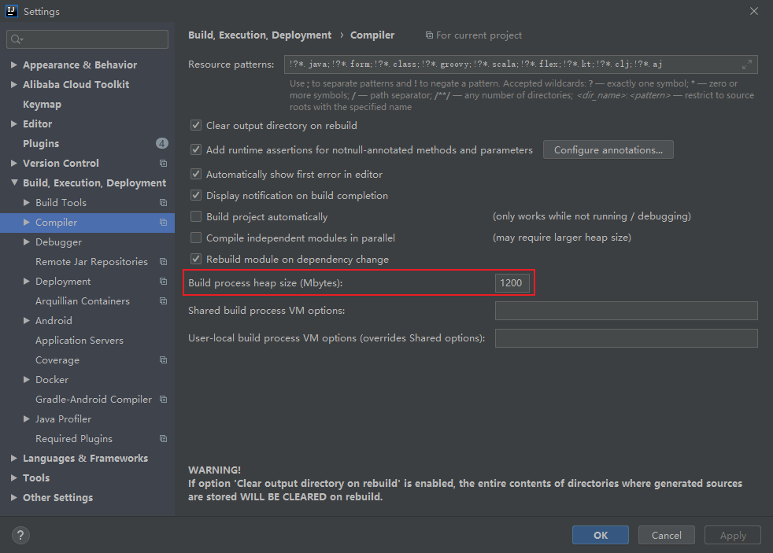

### 4.程序包com.sun.tools.javac.*不存在

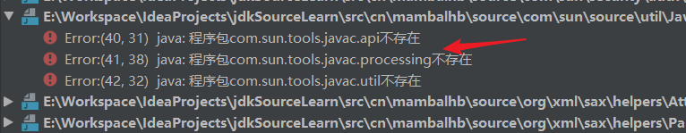

这是缺少tools的jar包所导致的。
点击**File–>Project Structure–>Libraries**

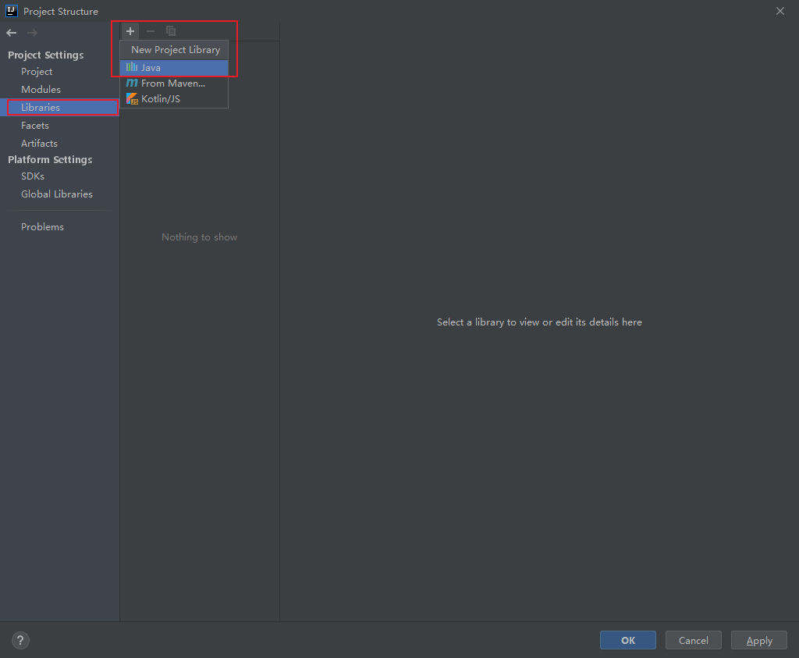

选择JDK安装目录，在lib目录下找到tools.jar，点击ok导入即可。

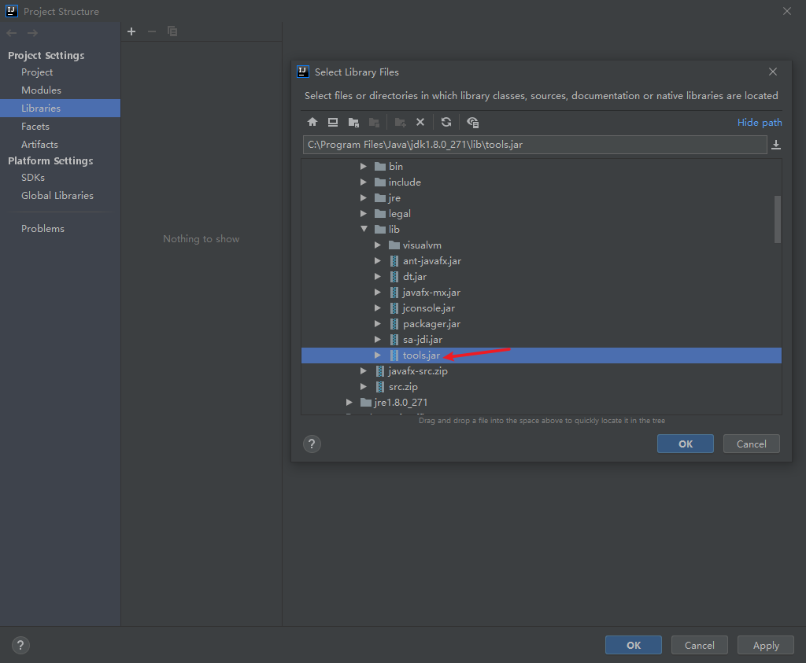

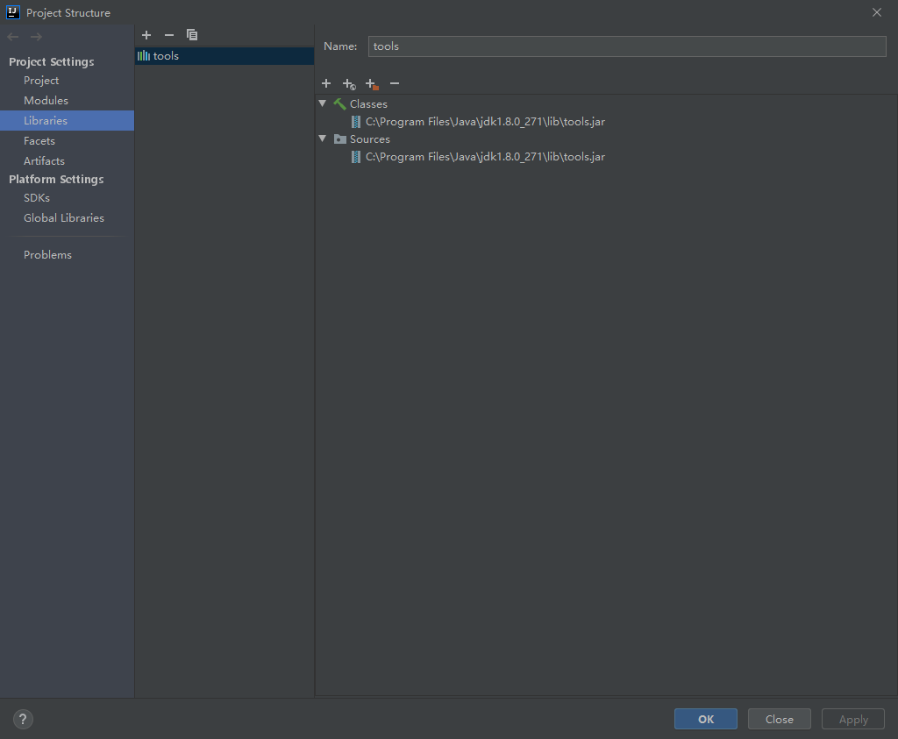

### 5.找不到符号UNIXToolkit、FontConfigManager

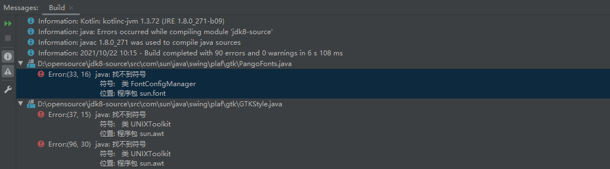

这是因为在Windows平台下缺少了两个java类文件所导致的。
这两个类文件可在[OpenJDK](http://openjdk.java.net)网站上找到。

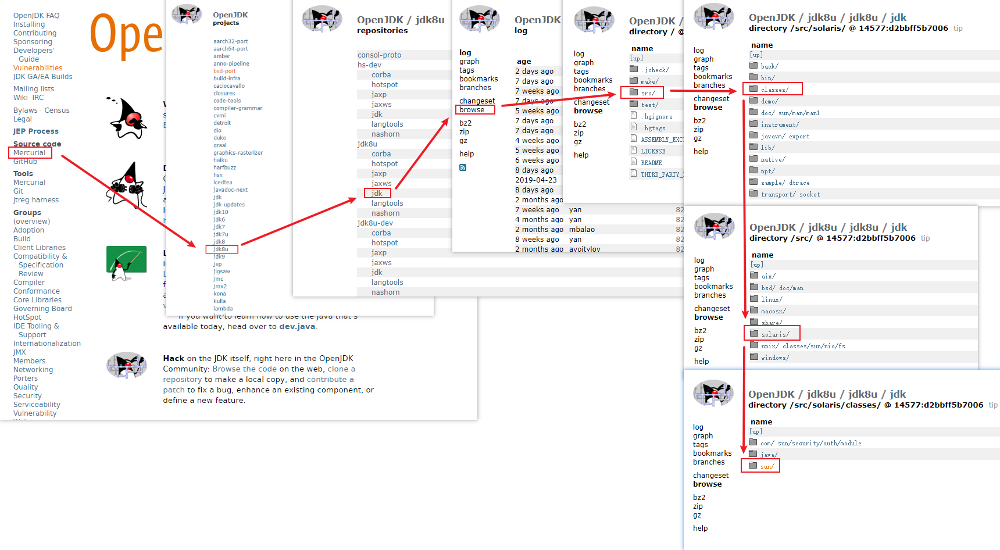

## 完善项目设置

### 1.允许调试进入

此时如果我们打断点进行单步调试的话，可以发现点击Step Into无法进入源码内部，因为JDK源码的受保护的，无法进入，但是点击**Force Step Into**是可以进入源码内部的。如果想要直接按F7(即点击**Step Into**)进入源码内部的话，需要做如下设置：
点击**File–>Settings–>Build,Execution,Deployment–>Debugger–>Stepping**，取消勾选**Do not step into the classes**。

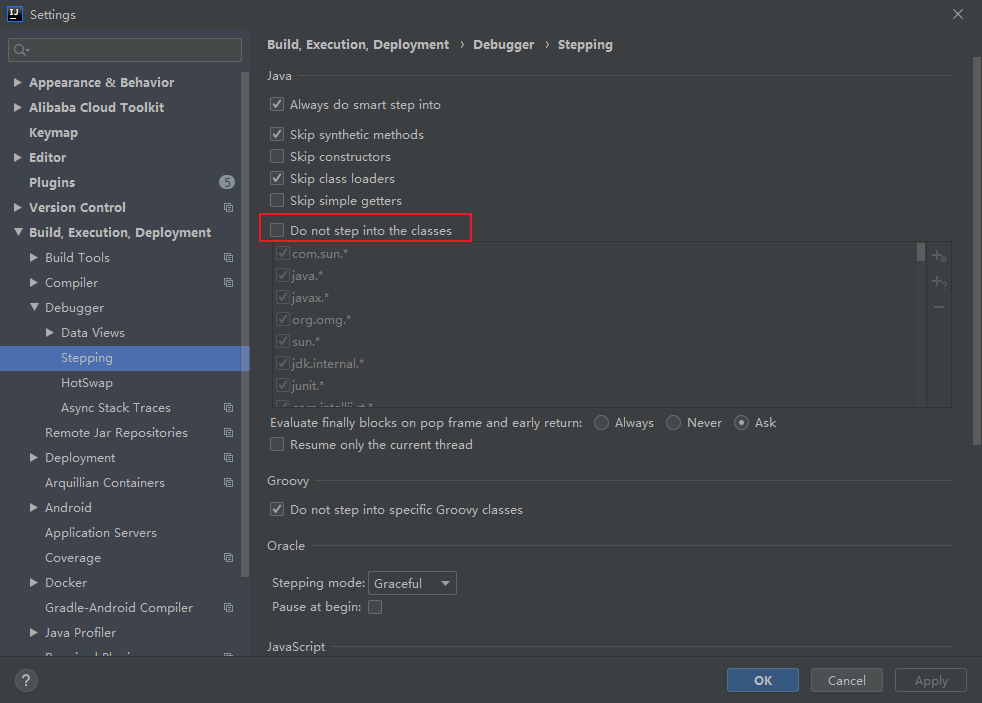

### 1.编辑源文件

如果我们想要对源码文件做记录或者注释时，会发现源码文件是只读的，无法编辑。因为此时项目关联的源码文件还不是刚才复制进项目的文件，而是jdk安装目录下的源码文件。重新将项目关联的源码文件设置成该项目下的源码文件即可。
点击**File–>Project Structure–>SDKs**

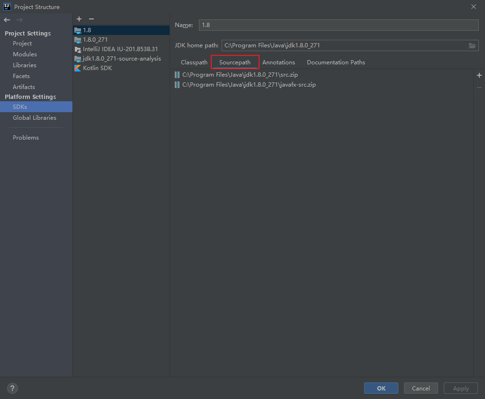

这里将原先的jdk安装目录下关联的源码路径删除，添加刚才拷贝至项目目录下的源码路径。

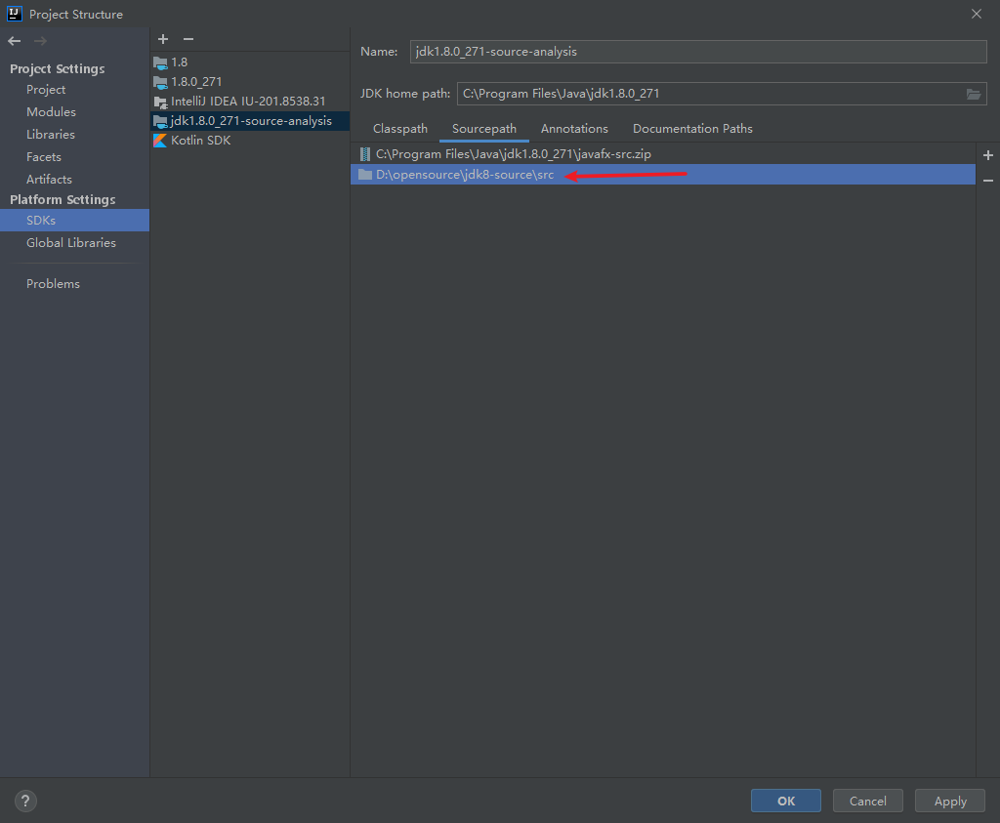

这个时候，再进行调试进入源码内部的时候，可以发现，文件上面的小锁标志已经不见了，源码文件也可以进行注释记录了。